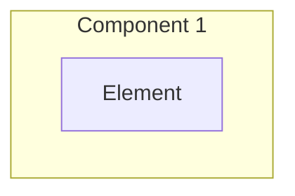

# /feature-new

Input: $ARGUMENTS

## Format A (Preferred): YAML block
```
slug: user-export
title: User export feature
notes: |
  Any extra context.
```

## Format B: One-liner
```
user-export --title "User export feature" --notes "..."
```

---

## Rules
1. Branch name: `feature/<slug>`
2. Spec folder: `agent-os/specs/<YYYY-MM-DD>-<slug>/`
3. No secrets, no `.env` reads
4. Local commits only (no push)

---

## Steps

### Step 1: Parse $ARGUMENTS
Extract:
- slug (required, lowercase, hyphen-separated)
- title (optional, derived from slug)
- notes (optional)

### Step 2: Ensure agent-os folders exist
- `agent-os/specs/`

### Step 3: Create branch
```bash
git checkout -b feature/<slug>
```

### Step 4: Create Feature Folder Structure
Create `agent-os/specs/<YYYY-MM-DD>-<slug>/`:
```
agent-os/specs/<YYYY-MM-DD>-<slug>/
├── planning/
│   ├── raw-idea.md        # User's original prompt (PRESERVED on re-plan)
│   └── requirements.md    # Feature requirements (or shaped-requirements.md)
├── orchestration.yml      # Task group orchestration (created by /plan)
├── spec.md                # Feature specification
└── tasks.md               # Task breakdown (created by /plan)
```

### Step 5: Create Raw Idea (User's Original Prompt)
Create `agent-os/specs/<YYYY-MM-DD>-<slug>/planning/raw-idea.md`:

```markdown
# Raw Idea: <Title>

**Type:** feature
**Slug:** <slug>
**Created:** <YYYY-MM-DD>

## Original Input

```
<Copy the entire $ARGUMENTS exactly as provided by user>
```

## Parsed Values

- **Slug:** <slug>
- **Title:** <title or derived from slug>
- **Notes:** <notes if provided, or "none">
```

### Step 6: Create Feature Requirements
Create `agent-os/specs/<YYYY-MM-DD>-<slug>/planning/requirements.md`:

```markdown
# Feature Requirements: <Title>

## Overview
<!-- What problem does this solve? Who benefits? -->

## User Stories
- As a <user>, I want to <action>, so that <benefit>

## Functional Requirements
1. 
2. 
3. 

## Non-Functional Requirements
- Performance:
- Security:
- Accessibility:

## Acceptance Criteria
- [ ] 
- [ ] 
- [ ] 

## Out of Scope
- 

## Notes
<notes if provided>
```

### Step 7: Create Feature Spec
Create `agent-os/specs/<YYYY-MM-DD>-<slug>/spec.md`:

```markdown
# Specification: <Title>

## Executive Summary

<!-- Brief overview of the feature and its value -->

---

## Problem Statement

**Current State:**
- 

**Desired State:**
- 

**Impact:**
- 

---

## Goals & Success Criteria

### Primary Goals
1. 
2. 
3. 

### Success Criteria
- [ ] 
- [ ] 
- [ ] 

### Non-Goals
- 

---

## Architecture Overview

### High-Level System Architecture



---

## Technical Design

### Django Backend
- Models:
- Views/APIs:
- URLs:
- Celery Tasks:

---

## Data Model Changes

<!-- Include ER diagrams if applicable -->

---

## API Specification

### Endpoint Overview
<!-- Document new/modified endpoints -->

---

## Testing Strategy

### Unit Tests
- 

### Integration Tests
- 

### E2E Tests
- 

---

## Migration Plan

### Phase 1
- 

---

## Security Considerations

- 

---

## Performance Considerations

- 

---

## Summary

<!-- Final summary of the feature -->
```

### Step 8: Commit
```bash
git add agent-os/specs/<YYYY-MM-DD>-<slug>/
git commit -m "chore(feature): initialize <slug> spec"
```

## Output
- Feature slug:
- Branch name:
- Spec path: `agent-os/specs/<YYYY-MM-DD>-<slug>/spec.md`
- Next: `/plan <slug>`

## IMPORTANT
**DO NOT automatically run `/plan`.** Always ask the user:
> "Feature initialized. Ready to run `/plan <slug>`?"

Wait for explicit user confirmation before proceeding.
