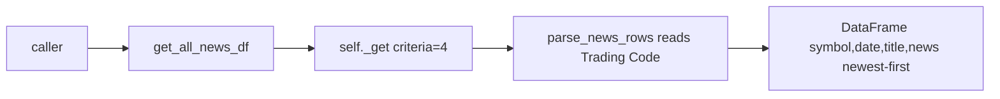

# Specification: Bulk date-range news scraper

## Executive Summary

Add `FundamentalData.get_all_news_df(start_date, end_date)` — a single-request,
market-wide news scraper. It uses DSE's `old_news.php` date-range mode
(`criteria=4`, empty `inst`) to return every symbol's news in one HTTP call,
replacing the ~400 per-symbol requests a whole-market consumer needs today.
`get_news_df` stays unchanged for backward compatibility; both methods share a
refactored `parse_news_rows` that reads the symbol from the page itself.

---

## Problem Statement

**Current State:**
- `get_news_df(symbol, years=2)` hits `NEWS_URL + symbol`
  (`criteria=3&inst=<symbol>`), one request per company.
- A market-wide consumer makes ~400 requests per run — slow and failure-prone.

**Desired State:**
- One request returns all symbols' news over a date range
  (`criteria=4&startDate=…&endDate=…&inst=`).
- The same `table.table-news` structure is parsed; each block carries its own
  Trading Code, so the symbol is read from the page.

**Impact:**
- ~400 requests → 1 per run for downstream consumers (e.g. MarketWiki BD).

---

## Goals & Success Criteria

### Primary Goals
1. Add `get_all_news_df(start_date, end_date)` using date-range mode.
2. Refactor `parse_news_rows` to source the symbol from the page.
3. Keep `get_news_df` behavior identical.

### Success Criteria
- [ ] One call returns a multi-symbol DataFrame `[symbol, date, title, news]`.
- [ ] Unit test proves multiple distinct symbols parse + group from one page.
- [ ] `get_news_df` regression-free.
- [ ] Version bumped.

### Non-Goals
- Pseudo-code filtering, a save helper, or downstream `sync_news` rewrite.

---

## Technical Design

### Module
`stocksurferbd_pkg/stocksurferbd/fundamental_data_scraper.py`

### New constant
```python
# date-range mode: criteria=4, startDate/endDate required, empty inst = all symbols
NEWS_RANGE_URL = "https://www.dsebd.org/old_news.php?archive=news&criteria=4"
```

### `parse_news_rows(soup, symbol=None)` (refactor)
- On the `"Trading Code"` label, start a new record and set
  `current['symbol'] = value` (page value). Keep `symbol` param as a fallback
  default for the rare case a block lacks the cell.
- No other behavior changes; `get_news_df` keeps passing its `symbol`.

### `get_all_news_df(self, start_date, end_date)` (new)
1. Normalize `start_date`/`end_date`: accept `str` or `date`/`datetime`; format
   as `YYYY-MM-DD`.
2. Build URL: `NEWS_RANGE_URL + f"&startDate={start}&endDate={end}&inst="`.
3. `target_page = self._get(full_url)`; parse with `BeautifulSoup`.
4. `records = self.parse_news_rows(page_html)`.
5. Build DataFrame `['symbol','date','title','news']`; if empty, return as-is.
6. `pd.to_datetime(errors='coerce')` → drop NaT → sort newest-first →
   `reset_index` → `date` back to `.date`. No `years` cutoff.

### Data flow


---

## Testing Strategy

### Unit Tests
- Mock an HTML fixture containing ≥2 distinct Trading Codes with full blocks.
- Assert `parse_news_rows` (or `get_all_news_df` via patched `_get`) yields the
  expected per-symbol grouping with no empty `symbol`/`date`/`title`.
- Regression: existing single-symbol `parse_news_rows`/`get_news_df` still works.

### Manual Smoke
- `FundamentalData(verify=False).get_all_news_df('2026-06-15','2026-06-17')`
  returns a multi-symbol DataFrame with no empty `symbol`/`date`/`title`.

---

## Migration / Release

### Phase 1
- Implement method + parser refactor + tests.

### Phase 2
- Bump package version; update CHANGELOG so MarketWiki BD can pin it.

---

## Security Considerations
- Same DSE endpoint, session, and verify handling as existing scrapers. No
  secrets introduced.

---

## Performance Considerations
- One request for the whole market. A 1-year window ≈ 17k blocks in ~20s;
  caller sets `timeout=` on the constructor. Short windows return sub-second.

---

## Summary
A single new method plus a small, backward-compatible parser refactor collapse
a ~400-request market-wide news pull into one request, with the symbol sourced
from the page. `get_news_df` is untouched; a version bump readies it for release.
